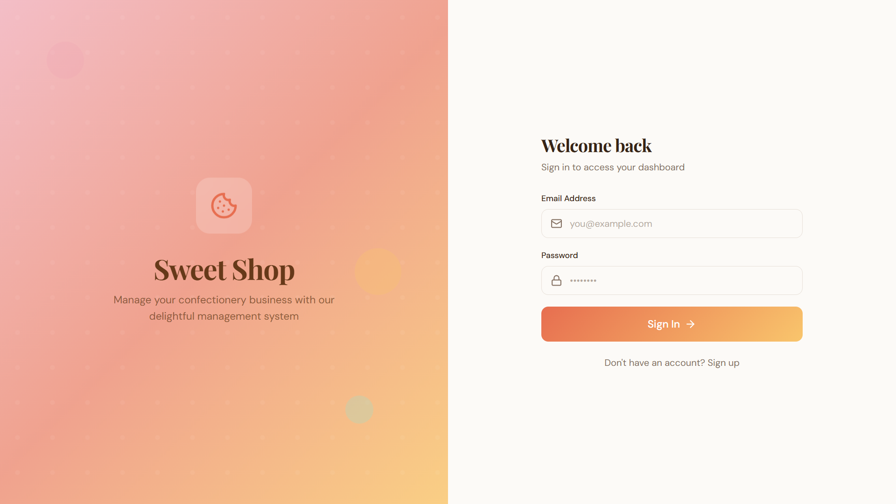
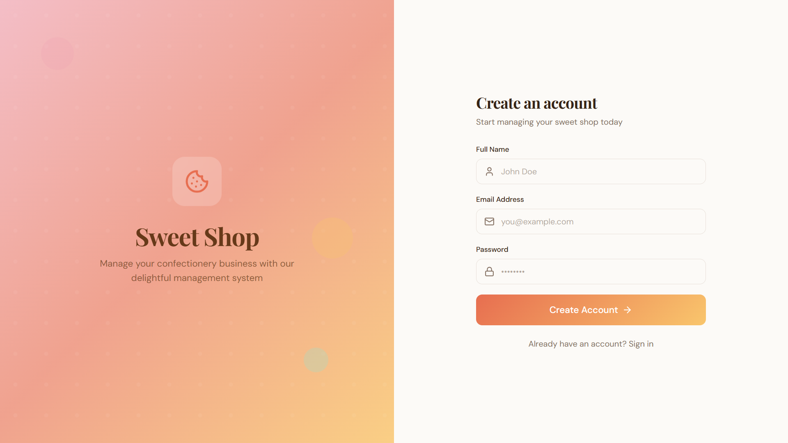
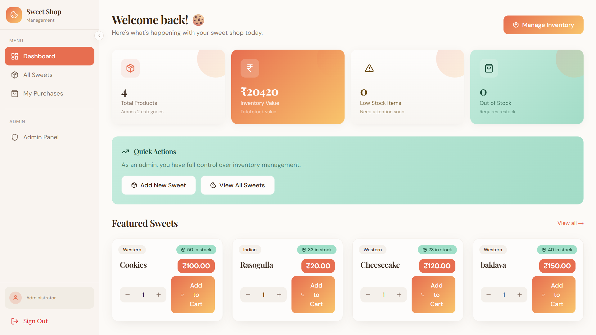
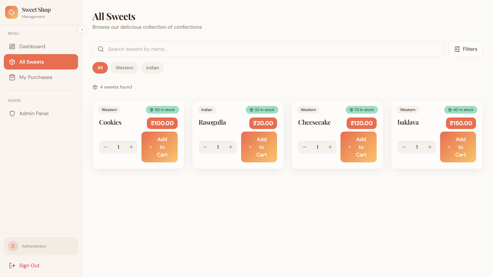
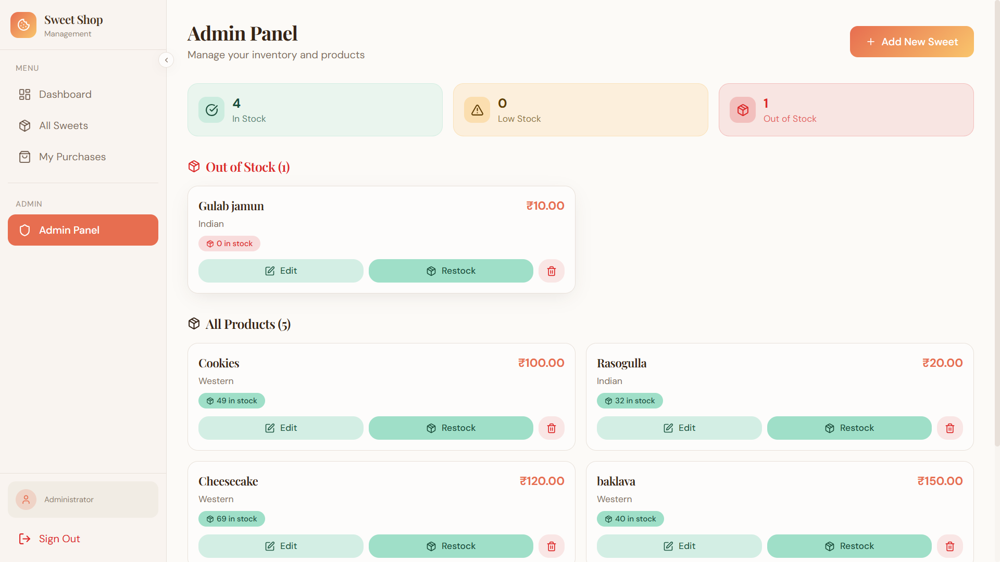

# Sweet Shop Management System  
**TDD Kata – Full-Stack Assessment**

---

## 📌 Project Overview

The **Sweet Shop Management System** is a full-stack web application built as part of a **Test-Driven Development (TDD) Kata**.  
This project demonstrates skills in **REST API development, database management, frontend implementation, testing, clean coding practices, Git workflows, and responsible AI usage**.

The system allows users to manage sweets inventory, purchase sweets, and perform administrative actions such as adding, updating, restocking, and deleting sweets, secured using **JWT-based authentication**.

---

## 🎯 Objective

- Build a robust RESTful backend API  
- Implement JWT-based authentication  
- Develop a modern frontend SPA  
- Follow Test-Driven Development (TDD)  
- Maintain clean and meaningful Git history  
- Use AI tools transparently and responsibly  

---

## 🌐 Live Links

- **Backend API (Render):**  
  https://sweetmanagementsystem-gdry.onrender.com

- **Frontend Application:**  
  https://sweet-management-system-eqgi.vercel.app/

---

## 🧱 Tech Stack

### Backend
- Node.js
- Express.js
- MongoDB + Mongoose
- JWT Authentication
- Jest + Supertest

### Frontend
- React (Vite)
- Tailwind CSS
- REST API Integration

---

## ✨ Features

### 👤 Authentication
- User registration
- User login
- JWT-based authentication
- Role-based access (User / Admin)

### 🍭 Sweet Management (Protected)
- Add a new sweet
- View all sweets
- Search sweets by name, category, or price range
- Update sweet details
- Delete sweet (Admin only)

### 📦 Inventory Management
- Purchase sweet (quantity decreases)
- Restock sweet (Admin only)
- Purchase disabled when quantity is zero

---

## 🔐 API Endpoints

### Authentication

| Method | Endpoint | Description |
|------|---------|------------|
| POST | `/api/auth/register` | Register a new user |
| POST | `/api/auth/login` | Login user & receive JWT |

### Sweets (Protected)

| Method | Endpoint | Description |
|------|---------|------------|
| POST | `/api/sweets` | Add new sweet |
| GET | `/api/sweets` | Get all sweets |
| GET | `/api/sweets/search` | Search sweets |
| PUT | `/api/sweets/:id` | Update sweet |
| DELETE | `/api/sweets/:id` | Delete sweet (Admin) |

### Inventory
| Method | Endpoint | Description |
|------|---------|------------|
| POST | `/api/sweets/:id/purchase` | Purchase sweet |
| POST | `/api/sweets/:id/restock` | Restock sweet (Admin) |

---

## 🗂 Project Structure

```text
SweetManagementSystem/
├── backend/
│ ├── src/
│ │ ├── app.js
│ │ ├── server.js
│ │ ├── config/
│ │ ├── controllers/
│ │ ├── middleware/
│ │ ├── models/
│ │ └── routes/
│ ├── tests/
│ ├── .env
│ └── package.json
│
├── frontend/
│ ├── src/
│ ├── .env
│ └── package.json
│
├── .gitignore
└── README.md
```

---

## ⚙️ Setup & Run Locally

### Prerequisites
- Node.js (v18+)
- MongoDB (Atlas or local)
- Git

---

### Backend Setup

```bash
cd backend
npm install
```

Create .env inside backend/:
```bash
MONGO_URI=your_mongodb_connection_string
JWT_SECRET=your_jwt_secret
PORT=5000
FRONTEND_URL=http://localhost:8080
```

Run backend:

```bash
npm run dev
```

Backend runs at:

```bash
http://localhost:5000
```

### Frontend Setup
```bash
cd frontend
npm install
```

Create .env inside frontend/:
```bash
VITE_API_BASE_URL=http://localhost:5000
```

Run frontend:

```bash
npm run dev
```

Frontend runs at:

```bash
http://localhost:8080
```

## 🧪 Testing (TDD)

Backend logic was implemented using Test-Driven Development following the Red → Green → Refactor cycle.

Run tests:

```bash
cd backend
npm test
```

### Test Coverage

- Authentication flows
- Protected routes
- Sweet CRUD operations
- Inventory purchase & restock logic

### 📊 Test Report

All backend tests pass successfully using Jest and Supertest.


## 📸 Application Screenshots

Below are screenshots showcasing the key features and user flows of the Sweet Shop Management System.

### 🔐 Authentication

**Login Page**  
User login using email and password.



**Registration Page**  
New user registration with basic details.



---

### 📊 Dashboard

**Dashboard Overview**  
Displays key inventory metrics such as total products, inventory value, low stock items, and out-of-stock items.



---

### 🍭 Sweets Listing

**All Sweets Page**  
Browse all available sweets with category filters, search functionality, pricing, and stock status.



---

### 🛠️ Admin Panel

**Admin Inventory Management**  
Admin view for managing sweets inventory, including editing details, restocking items, and deleting sweets.




## 🤖 My AI Usage

I used **ChatGPT** in a limited and intentional manner during this project.

### How AI Was Used
- To **understand and break down the assessment requirements**
- To **brainstorm the overall approach** for implementing the Sweet Shop Management System
- To **refine and structure the README.md** for clarity and completeness

### How AI Was NOT Used
- AI was **not used to write backend or frontend code**
- AI was **not used to implement APIs, business logic, or database schemas**
- AI was **not used to write or generate test cases**
- All development, testing, debugging, and integration work was done manually by me

### Reflection
Using AI at the planning and documentation level helped me clearly understand the problem statement and present my work more effectively, while ensuring that the **entire codebase and technical implementation are fully my own**.